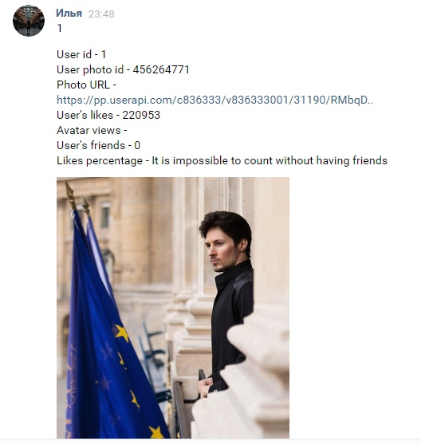

Simple VK bot.
Upon request, provides information about the user

How to use:
- pip install vk_api
- https://vkhost.github.io/ choose Kate Mobile and take token from url
- run vk_bot.py or vk_bot_ru
- token = 'Enter token here'
- go to vk.com,  in private messages send the user ID to yourself

